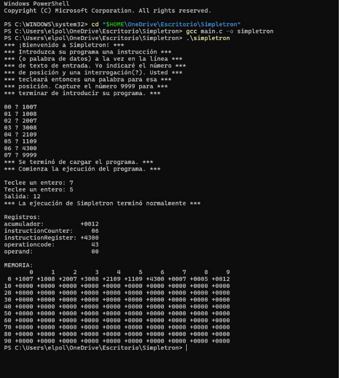
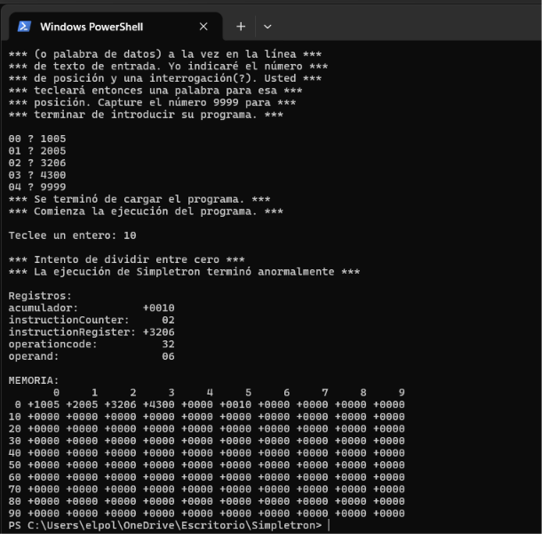

# Simulador Simpletron (SML) en C

Este proyecto es una implementación en lenguaje C del simulador de la computadora **Simpletron**, una arquitectura conceptual que ejecuta programas escritos en **Simpletron Machine Language (SML)**.

---

## 🛠️ Requisitos del Sistema
* **Compilador C:** `gcc` (MinGW / MSYS2 en Windows, Clang o GCC en Linux/macOS).
* **Entorno de ejecución:** Terminal de comandos (PowerShell, CMD o Terminal integrada de VS Code).

---

## 🚀 Compilación y Ejecución

1. Abre la terminal en la carpeta raíz del proyecto.
2. Compila el código fuente ejecutando:
   ```bash
   gcc main.c -o simpletron

#### 1.- Ejecuta el programa
Windows (PowerShell / CMD):
```bash
   .\simpletron
```

## 📖 Instrucciones de Uso 

1. Al arrancar, el programa solicitará la introducción de instrucciones SML una a una a partir de la posición `00`.

2. Introduce cada palabra de 4 dígitos (ejemplo: `1009`, `2005`).

3. Para finalizar la carga de instrucciones e iniciar la ejecución del programa, ingresa el código `9999`.

4. Al terminar la ejecución o ante un error fatal, se imprimirá automáticamente el Dump de Memoria y los registros internos.

## 💻 Tabla de Instrucciones SML Soportadas
| Categoría | Código | Instrucción | Descripción | 
| --- | --- | --- | --- |
| Entrada/Salida | `10` | `READ` | Lee una palabra del teclado y la guarda en una posición de memoria. |
| | `11` | `WRITE` | Muestra en pantalla la palabra de una posición de memoria. | 
| Carga/Almacenamiento | `20` | `LOAD` | Carga una palabra desde la memoria hacia el acumulador. |
| | `21` | `STORE` | Guarda el contenido del acumulador en una posición de memoria. | 
| Aritmética | `30` | `ADD` | Suma una palabra de memoria al acumulador. | 
| | `31` | `SUBTRACT` | Resta una palabra de memoria al acumulador. |
| | `32` | `DIVIDE` | Divide el acumulador entre una palabra de memoria. |
| | `33` | `MULTIPLY` | Multiplica el acumulador por una palabra de memoria. |
| Control de flujo | `40` | `BRANCH` | Salta a una posición de memoria específica. |
| | `41` | `BRANCHNEG` | Salta a una posición si el acumulador es negativo. |
| | `42` | `BRANCHZERO` | Salta a una posición si el acumulador es igual a cero. | 
| | `43` | `HALT` | Detiene la ejecución del programa. | 

## 🧪 Casos de Prueba Demostrativos

### Caso 1: Ejecución Correcta (Suma de dos números) 
**Entrada SML:**
- ` 00 ? 1007`  (READ a posición 07)

- ` 01 ? 1008`  (READ a posición 08)

- ` 02 ? 2007`  (LOAD posición 07)

- ` 03 ? 3008`  (ADD posición 08)

- ` 04 ? 2109`  (STORE a posición 09)

- ` 05 ? 1109`  (WRITE posición 09)

- ` 06 ? 4300`  (HALT)

- ` 07 ? 9999`  (Centinela)

**Ejecución:** 

- Teclee un entero: ` 7` 

- Teclee un entero: ` 5` 

- Salida: ` 12` 



### Caso 2: Error Fatal (División por Cero) 

**Entrada SML:**

` 00 ? 1005`  (READ a posición 05)

` 01 ? 2005`  (LOAD posición 05)

` 02 ? 3206`  (DIVIDE entre posición 06 vacía)

` 03 ? 4300`  (HALT)

` 04 ? 9999`  (Centinela)

**Ejecución:**

Teclee un entero: ` 10` 

Mensaje: ***Intento de dividir entre cero***

Estado: Ejecución abortada con Memory Dump.



## ⚠️ Limitaciones del Sistema

- Tamaño de Memoria: Limitado a 100 palabras (posiciones ` 00`  a ` 99` ).

- Rango de Palabras: Comprendido estrictamente entre ` -9999`  y ` +9999` .

- Desbordamiento: Si una operación sobrepasa el rango, la ejecución se interrumpe con error de Overflow.

- División por Cero: Cancela la ejecución del programa e imprime los registros.
